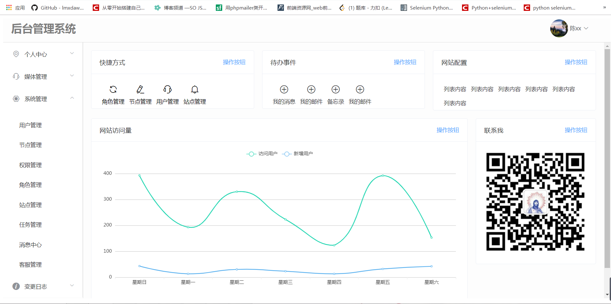
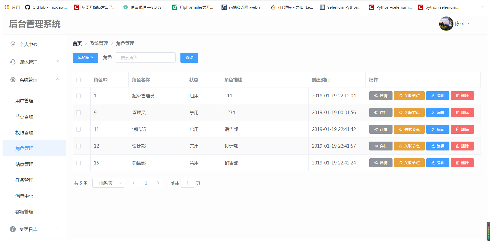
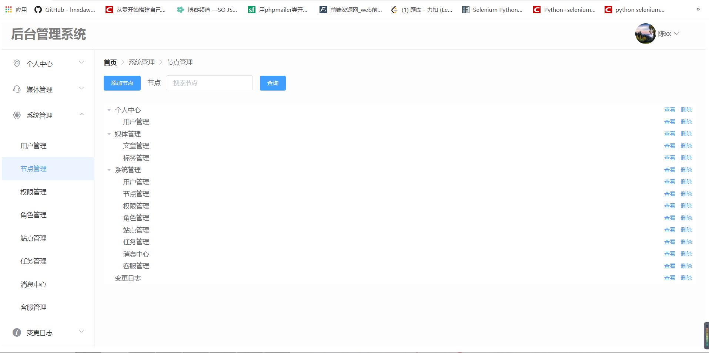
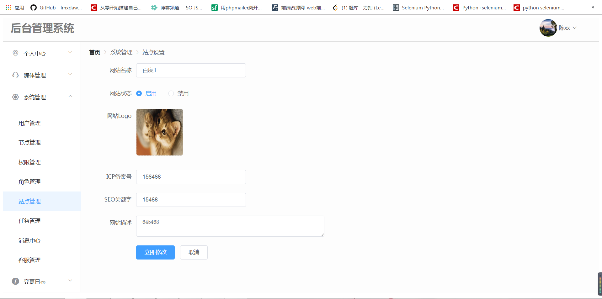
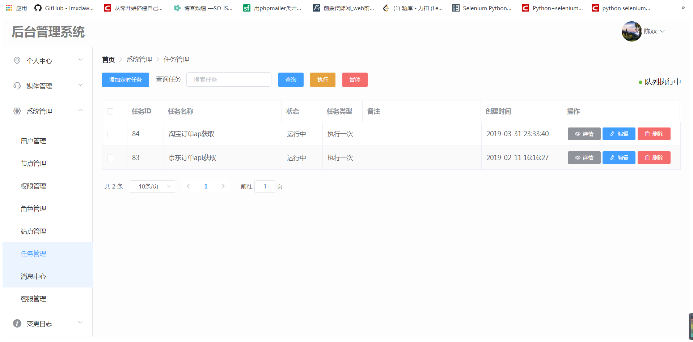
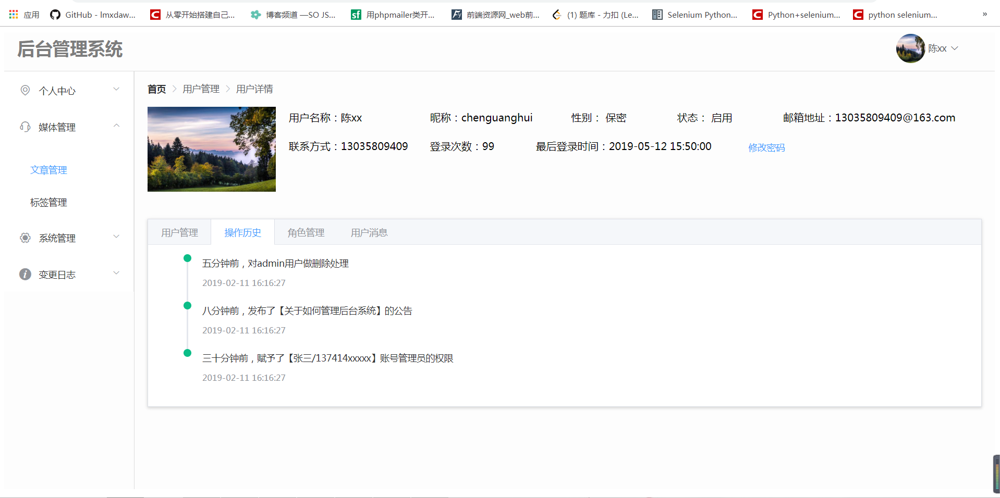
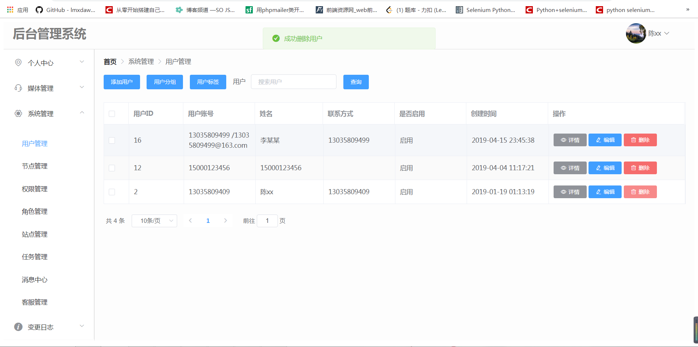

# vue-admin

> 基于vue的nuxt.js 服务渲染框架的后台框架，使用了docker部署方式。


## 功能介绍

- [x] **用户模块**
    - [x] 登录注册
    - [x] 找回密码
    - [ ] 邮箱激活
    - [x] 用户标签
    - [ ] 用户分组
- [x] **文章模块**
    - [x] 增删改查
    - [x] 标签管理
- [ ] **消息模块**
    - [x] 实时推送
    - [ ] IM聊天
- [x] **权限模块**
    - [x] 用户权限
    - [ ] 操作日志
- [x] **系统模块**
    - [x] 任务队列
    - [x] 角色管理
    - [x] 权限分配
    - [x] 节点管理
- [ ] **其他模块**
    - [ ] 微信授权

## Build Setup

``` bash
# install dependencies
$ npm install

# serve with hot reload at localhost:3000
$ npm run dev

# build for production and launch server
$ npm run build
$ npm start

# generate static project
$ npm run generate
```
pm2 部署:

<p><code> pm2 start npm --name "Vue-admin" -- run build </code></p>

docker 运行方式:

先构建镜像
<p><code> docker build -t nuxt-admin . </code></p>
然后启动容器
<p><code> docker run -dt -p 8080:3000 nuxt-admin </code></p>
打开浏览器访问
<p><code> <服务器 IP>:8080 </code></p>











For detailed explanation on how things work, checkout [Nuxt.js docs](https://nuxtjs.org).
